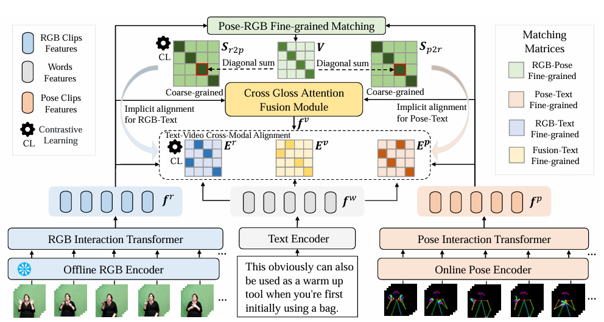

# SEDS: Semantically Enhanced Dual-Stream Encoder for Sign Language Retrieval

<b> <a href='https://longtaojiang.github.io/'>Longtao Jiang</a>, Min Wang†, Zecheng Li, Yao Fang, <a href='http://staff.ustc.edu.cn/~zhwg/'>Wengang Zhou†</a>, <a href='http://staff.ustc.edu.cn/~lihq/en/'>Houqiang Li </a> </b>

[Paper] [https://arxiv.org/abs/2407.16394](https://arxiv.org/abs/2407.16394) 

[Processed I3D Feature and RTM Keypoints] [BaiduDrive (password: seds)](https://pan.baidu.com/s/1bkDbIwgpA4OQiBEjDoPWfA) 

[Pre-trained model] [BaiduDrive (password: seds)](https://pan.baidu.com/s/1zdI1uS9h-bg39ZdsQuRzEg)

## News
- [2024/04/29] :fire: Release the code of SEDS and its guidance.
- [2025/04/27] :fire: Release the processed dataset and pre-trained models. [BaiduDrive (password: seds)](https://pan.baidu.com/s/1bkDbIwgpA4OQiBEjDoPWfA)/[BaiduDrive (password: seds)](https://pan.baidu.com/s/1zdI1uS9h-bg39ZdsQuRzEg)
- [2024/07/24] :sparkles: Release [paper](https://arxiv.org/abs/2407.16394).
- [2024/07/15] :tada: SEDS is accepted by ACM MM 2024.

## Abstract
> Sign language retrieval, as an emerging visual-language task, has received widespread attention. Different from traditional video retrieval, it is more biased towards understanding the semantic information of human actions contained in video clips. Previous works typically only encode RGB videos to obtain high-level semantic features, resulting in local action details drowned in a large amount of visual information redundancy. Furthermore, existing RGB-based sign retrieval works suffer from the huge memory cost of dense visual data embedding in end-to-end training, and adopt offline RGB encoder instead, leading to suboptimal feature representation. To address these issues, we propose a novel sign language representation framework called Semantically Enhanced Dual-Stream Encoder (SEDS), which integrates Pose and RGB modalities to represent the local and global information of sign language videos. Specifically, the Pose encoder embeds the coordinates of keypoints corresponding to human joints, effectively capturing detailed action features. For better context-aware fusion of two video modalities, we propose a Cross Gloss Attention Fusion (CGAF) module to aggregate the adjacent clip features with similar semantic information from intra-modality and inter-modality. Moreover, a Pose-RGB Fine-grained Matching Objective is developed to enhance the aggregated fusion feature by contextual matching of fine-grained dual-stream features. Besides the offline RGB encoder, the whole framework only contains learnable lightweight networks, which can be trained end-to-end. Extensive experiments demonstrate that our framework significantly outperforms state-of-the-art methods on How2Sign, PHOENIX-2014T, and CSL-Daily datasets.

## SEDS pipeline
<p align="center">

</p>

## Requirements
```
conda create -n seds python=3.10
conda activate seds
pip install torch==2.3.1+cu121 torchvision==0.18.1+cu121 -f https://download.pytorch.org/whl/torch_stable.html
pip install -r requirements.txt
```

## Processed I3D Feature and RTM Keypoints
The processed I3D feature and RTM keypoints can be downloaded from [BaiduDrive (password: seds)](https://pan.baidu.com/s/1bkDbIwgpA4OQiBEjDoPWfA). The processed dataset is organized as follows:
```
SEDS
└── datasets
    ├── CSL
    │   ├── I3D_features
    │   │   └──video1.pkl...
    │   ├── RTMpose
    │       └──video1.pkl...
    ├── How2Sign
    │   ├── I3D_features
    │   │   └──video1.pkl...
    │   ├── RTMpose
    │       └──video1.pkl...
    └── PHOENIX-2014-T
        ├── I3D_features
        │   └──video1.pkl...
        ├── RTMpose
            └──video1.pkl...

```
## Training
Before training, you should move the `pretrain_signbert.pth` to the `ckpts` folder and move the `ViT-B-32.pt` to the `modules` folder. Then, you can train the DIRE model by running the following command:
```
# train the model on CSL dataset.
bash scripts/train_csl.sh

# train the model on How2Sign dataset.
bash scripts/train_h2s.sh

# train the model on PHOENIX-2014-T dataset.
bash scripts/train_ph.sh
```
## Evaluation
We provide the pre-trained models in [[BaiduDrive (password: seds)](https://pan.baidu.com/s/1zdI1uS9h-bg39ZdsQuRzEg].
You can evaluate the models on the different datasets by running the following command:
```
# eval the model on CSL dataset.
bash scripts/eval_csl.sh

# eval the model on How2Sign dataset.
bash scripts/eval_h2s.sh

# eval the model on PHOENIX-2014-T dataset.
bash scripts/eval_ph.sh
```

## Acknowledgments
Our code is developed based on [CiCo](https://github.com/FangyunWei/SLRT/tree/main/CiCo). Thanks for their sharing codes and models.

## Citation
If you find this work useful for your research, please cite our paper:
```
@inproceedings{10.1145/3664647.3681237,
author = {Jiang, Longtao and Wang, Min and Li, Zecheng and Fang, Yao and Zhou, Wengang and Li, Houqiang},
title = {SEDS: Semantically Enhanced Dual-Stream Encoder for Sign Language Retrieval},
year = {2024},
isbn = {9798400706868},
publisher = {Association for Computing Machinery},
address = {New York, NY, USA},
url = {https://doi.org/10.1145/3664647.3681237},
doi = {10.1145/3664647.3681237},
booktitle = {Proceedings of the 32nd ACM International Conference on Multimedia},
pages = {5141–5150},
numpages = {10},
keywords = {feature fusion, multimodal alignment, sign language retrieval},
location = {Melbourne VIC, Australia},
series = {MM '24}
}
```
